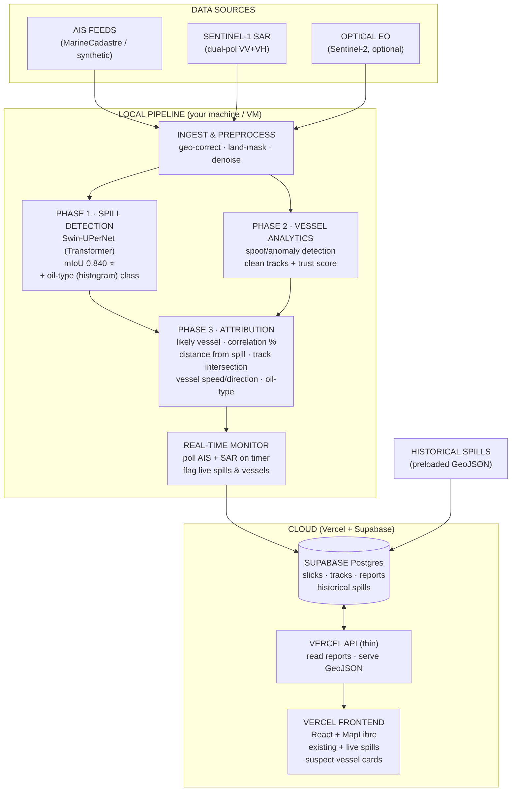
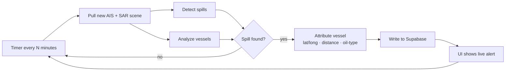
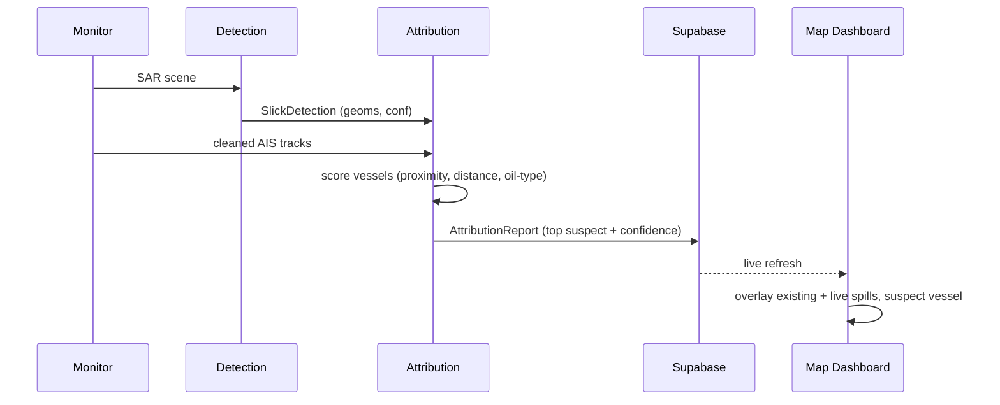

# Technical Approach Diagram

> Mermaid source. Renders natively on GitHub (and in VS Code / GitHub Markdown).
> A plain-text fallback is included at the bottom.

## Model Selection (research-backed)

Benchmark on high-resolution optical satellite data for oil-spill segmentation
(**mIoU = mean Intersection over Union**, higher is better):

| Model        | Architecture | mIoU  |
|--------------|--------------|-------|
| DeepLabV3+   | CNN          | 0.740 |
| Mask2Former  | Transformer  | 0.804 |
| **Swin-UPerNet** | **Transformer** | **0.840 ⭐** |

> **Decision:** Use **Swin-UPerNet** as the primary segmentation model — it
> achieved the highest mIoU (0.840). Complement with optical + SAR fusion and
> **histogram analysis** of predicted spill pixels for **oil-type classification**.

## System Architecture



## Real-Time Monitoring Loop



## Component Data Flow (single event)



## Plain-Text Fallback

```
DATA SOURCES                          LOCAL PIPELINE                        CLOUD
┌──────────────┐          ┌──────────────────────────────────────┐   ┌─────────────────────┐
│ AIS feeds    │──────┐   │ INGEST & PREPROCESS                  │   │ SUPABASE Postgres   │
│ SAR S1 VV+VH │──────┼──►│ geo-correct · land-mask · denoise   │   │ slicks·tracks·reports│
│ Optical EO   │──────┘   │ ──────────────────────────────────── │   └──────────┬──────────┘
└──────────────┘          │ PHASE1 Swin-UPerNet (mIoU 0.840)    │              │
                          │        + oil-type histogram          │              │
                          │ PHASE2 vessel AIS (spoof+trust)      │              │
                          │ PHASE3 attribution (likely vessel,   │              │
                          │        corr %, distance, intersection)│             │
                          │ ──────────────────────────────────── │              ▼
                          │ REAL-TIME MONITOR (timer → DB)       │──►   ┌─────────────────────┐
                          └──────────────────────────────────────┘      │ VERCELL API (thin)   │
                              │                                       │ map + GeoJSON        │
                              │ historical spills (preloaded)         └──────────┬──────────┘
                              └────────────────────────────────────►             ▼
                                                                     ┌─────────────────────┐
                                                                     │ FRONTEND React+MapLibre│
                                                                     │ existing + live spills│
                                                                     │ vessel correlation card│
                                                                     └─────────────────────┘
```

## Vessel Correlation Output (per spill)

For each detected spill, the system reports:

```
Likely vessel:          Vessel A (MMSI)
Vessel type:            Tanker
Correlation score:      87%
Distance from spill:    2.4 km
Track intersection:     Yes
Vessel speed:           3.1 kn (near-0 = discharge signature)
Vessel direction:       ~due south, consistent with drift
Oil type:               Crude (heavy)          ← from histogram analysis
```
